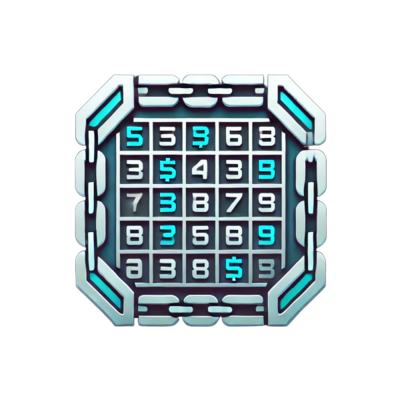

# <div align="center">Hanif Maulana - Creative Portfolio</div>

<div align="center">
  
  <br><br>
  
  [](https://isaacnewton.site)
  [](https://x.com/isaac_newton252)
  [](https://github.com/isaacnewton123)
  [](https://www.linkedin.com/in/hanif-maulana-210b4721b/)
</div>

---

## 📋 Table of Contents
- [Overview](#-overview)
- [Features](#-features)
- [Live Demo](#-live-demo)
- [Screenshots](#-screenshots)
- [Technologies Used](#️-technologies-used)
- [Installation & Setup](#-installation--setup)
- [Project Structure](#-project-structure)
- [Projects Showcase](#-projects-showcase)
- [Creative Works](#-creative-works)
- [Contact](#-contact)
- [License](#-license)

---

## 🚀 Overview

A modern, responsive portfolio website showcasing my skills, projects, and creative works in design and development. This portfolio features interactive elements, smooth animations, and a clean design to highlight my professional journey and expertise.

<div align="center">
  <strong>✨ Design • Develop • Create ✨</strong>
</div>

---

## ✨ Features

- **📱 Responsive Design:** Fully optimized for all devices (mobile, tablet, desktop)
- **🖥 Interactive UI:** Engaging user experience with modern interactions
- **🔄 Dynamic Content:** Showcases projects, artwork, and skills
- **⚡ Performance Optimized:** Fast loading, efficient animations
- **♿ Accessibility:** Designed with accessibility in mind
- **🔍 SEO Ready:** Includes all necessary meta tags for better search engine visibility

---

## 🌐 Live Demo

Experience the live portfolio: [isaacnewton.site](https://isaacnewton.site)

---

## 📸 Screenshots

<div align="center">
  
  
</div>

---

## 🛠️ Technologies Used

<div align="center">
  
  
  
  
  
</div>

### Animation Libraries:
- **AOS** - Animate on Scroll
- **GSAP** - GreenSock Animation Platform
- **Typed.js** - Text typing animations

### UI Components:
- **Swiper** - Touch-enabled slider component
- **Vanilla Tilt** - 3D hover effects

---

## 🔧 Installation & Setup

1. **Clone the repository:**
   ```bash
   git clone https://github.com/isaacnewton123/portfolio.git
   cd portfolio
   ```

2. **Open in your preferred code editor**

3. **Launch with a local server:**
   - Using VS Code: Install Live Server extension and click "Go Live"
   - Using Python: `python -m http.server`
   - Using Node.js: `npx serve`

---

## 🔍 Project Structure

```
portfolio/
├── assets/            # Images and media files
│   ├── 2D/            # 2D artwork
│   ├── 3D/            # 3D models and animations
│   └── ProjectLogo/   # Project logos
├── index.html         # Main HTML file
├── styles.css         # CSS styles
├── script.js          # JavaScript functionality
└── README.md          # Project documentation
```

---

## 🌟 Projects Showcase

<table>
  <tr>
    <td width="33%">
      <h3>Crypto Sudoku</h3>
      
      <p>A blockchain-powered Sudoku game where players can earn crypto rewards for solving puzzles and competing in tournaments.</p>
      <a href="https://cryptosudoku.xyz/">View Project →</a>
    </td>
    <td width="33%">
      <h3>Multi Uploads</h3>
      
      <p>Advanced file upload service with enhanced security features, batch processing, and cloud storage integration.</p>
      <a href="https://multiuploads.xyz/">View Project →</a>
    </td>
    <td width="33%">
      <h3>Gravity Multi Sender</h3>
      
      <p>Blockchain-based multi-transaction sender service that allows batch transfers with minimal gas fees and maximum security.</p>
      <a href="https://gravitymultisender.xyz/">View Project →</a>
    </td>
  </tr>
</table>

---

## 🎨 Creative Works

### 3D Models
- Game environments and assets
- Character designs with animation
- Interactive 3D visualizations

### 2D Artwork
- Event announcement designs
- Character designs for digital branding
- Creative animations for special occasions

---

## 📱 Contact

<div align="center">

[](mailto:hanif@isaacnewton.site)
[](https://www.instagram.com/hanifmaulana2/)

**Location:** Karawang, Indonesia

</div>

---

## 📄 License

This project is licensed under the MIT License - see the LICENSE file for details.

---

<div align="center">
  <p>© 2023 Hanif Maulana | Portfolio Website</p>
  <p>Made with ❤️ and creative passion</p>
</div> 